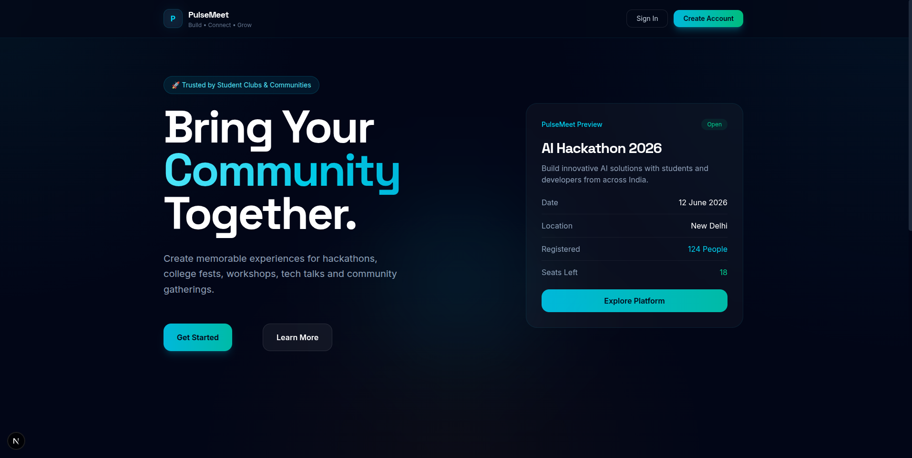
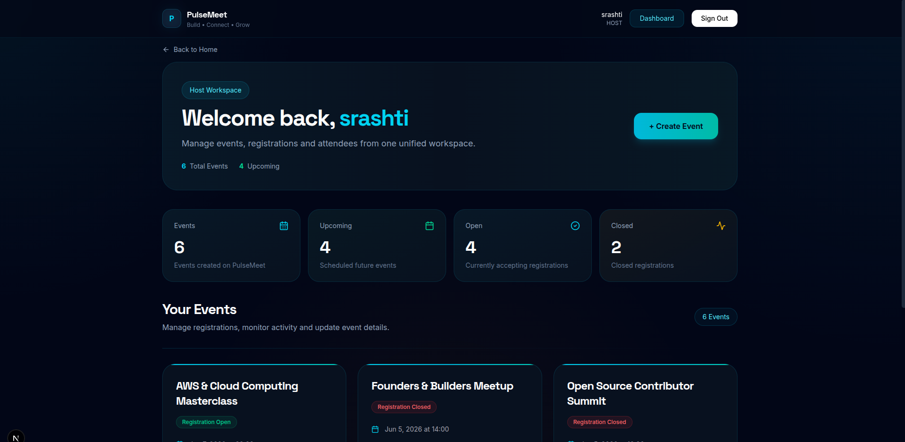
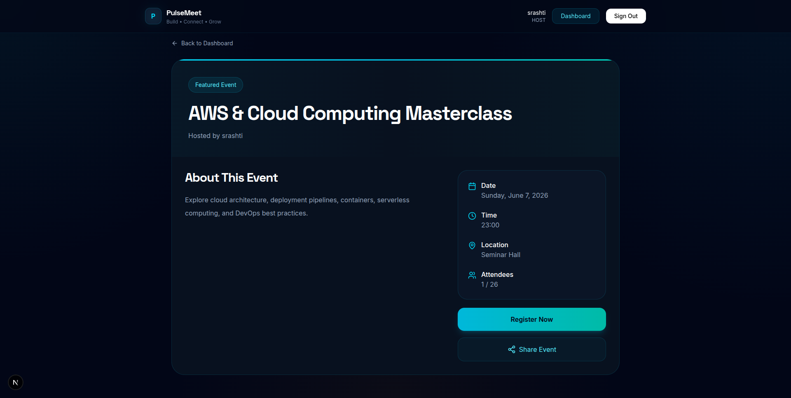
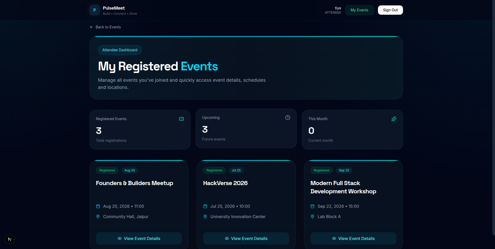

# 🚀 PulseMeet

<div align="center">

### Modern Event Registration & Management Platform

Built with Next.js, React, TypeScript, MongoDB & NextAuth.js

<br/>


</div>

---

# 📖 Overview

PulseMeet is a modern full-stack Event Registration & Management Platform inspired by event platforms such as Luma.

The application enables hosts to create and manage public events while allowing attendees to discover, register, and track their participation through secure dashboards.

This project demonstrates full-stack development skills including authentication, database integration, secure registration workflows, role-based access control, attendee management, and CSV export functionality.

---

# 🌐 Live Demo

https://pulse-meet-nine.vercel.app

---

# 🌟 Core Features

## 👨‍💼 Host Features

* Secure Host Registration & Login
* Create Public Events
* Edit Existing Events
* Delete Events
* Manage Event Registrations
* View Attendee Information
* Search Attendees
* Export Attendee Lists as CSV
* Capacity Management
* Registration Deadline Controls

---

## 🎟️ Attendee Features

* Secure Registration & Login
* Register for Public Events
* View Registered Events
* Track Event Participation
* Access Event Details

---

## 🌐 Public Features

* Public Event Pages
* Shareable Event URLs
* Event Information Display
* Registration Status Visibility
* Live Attendee Counts

---

## 🔒 Security Features

* Password Hashing with bcryptjs
* JWT Session Authentication
* Protected Host Dashboards
* Role-Based Access Control
* Event Ownership Verification
* Duplicate Registration Prevention
* Passwords Never Exposed in APIs
* Passwords Never Exported in CSV Reports

---

# ✅ Bonus Features Implemented

* Duplicate Registration Prevention
* Capacity Limit Enforcement
* Registration Cutoff Date & Time
* Public Attendee Count Display
* Event Editing
* Event Deletion
* Attendee Search & Filtering
* CSV Export Functionality
* Responsive Mobile-First UI
* Modern Animated User Interface

---

# 🛠️ Tech Stack

## Frontend

* Next.js (App Router)
* React 19
* TypeScript
* Tailwind CSS v4
* Framer Motion
* Lucide React

## Backend

* Next.js Route Handlers
* NextAuth.js
* bcryptjs

## Database

* MongoDB Atlas
* Mongoose ODM

## Deployment

* Vercel
* MongoDB Atlas

---

# 🏗️ Architecture

PulseMeet follows a modern full-stack architecture consisting of four layers:

### Presentation Layer

* React Components
* Next.js App Router
* Tailwind CSS
* Framer Motion

### Application Layer

* Route Handlers
* Business Logic
* Validation
* Authorization

### Authentication Layer

* NextAuth.js
* JWT Sessions
* Password Verification

### Data Layer

* MongoDB Atlas
* Mongoose Models

---

# 📂 Project Structure

```text
src/
├── app/
│   ├── (auth)/
│   ├── api/
│   ├── attendee/
│   ├── dashboard/
│   └── events/
│
├── components/
├── lib/
├── models/
├── types/
└── docs/
```

---

# 🗄️ Database Models

## User

Stores:

* Name
* Email
* Password (Hashed)
* Role (HOST / ATTENDEE)

---

## Event

Stores:

* Title
* Description
* Date
* Time
* Location
* Host Information
* Capacity
* Registration Cutoff
* Event Status

---

## Registration

Stores:

* Event Reference
* Attendee Reference

A compound unique constraint prevents duplicate registrations.

---

# 🔌 API Capabilities

## Authentication

* User Registration
* User Login
* Session Management

## Event Management

* Create Event
* Edit Event
* Delete Event
* Fetch Events

## Registration

* Register for Event
* Duplicate Registration Prevention
* Capacity Validation
* Registration Cutoff Validation

## Dashboard

* View Attendees
* Search Attendees
* CSV Export

---


# 📸 Screenshots

## 🏠 Home Page

<p align="center">
  
</p>

---

## 👨‍💼 Host Dashboard

<p align="center">
  
</p>

---

## 🌐 Public Event Page

<p align="center">
  
</p>

---

## 🎟️ Attendee Dashboard

<p align="center">
  
</p>

---

# ⚙️ Environment Variables

Create a `.env.local` file:

```env
MONGODB_URI=your_mongodb_connection_string

NEXTAUTH_SECRET=your_secret_key

NEXTAUTH_URL=http://localhost:3000
```

---

# 🚀 Local Setup

## 1. Clone Repository

```bash
git clone https://github.com/SrashtiChauhan/PulseMeet.git
```

## 2. Navigate into Project

```bash
cd PulseMeet
```

## 3. Install Dependencies

```bash
npm install
```

## 4. Configure Environment Variables

Create:

```text
.env.local
```

Add the required variables.

---

## 5. Run Development Server

```bash
npm run dev
```

Open:

```text
http://localhost:3000
```

---

# 📚 Documentation

Detailed project documentation is available in the `/docs` directory.

* API Documentation
* Architecture Documentation
* Deployment Guide
* Functional Architecture Document (FAD)
* Feature Traceability List (FTL)
* Product Requirements Document (PRD)
* System Architecture Document (SAD)
* Technical Architecture Document (TAD)

---

# 🔮 Future Enhancements

Potential future improvements include:

* Event Categories
* Event Images & Banners
* Social Authentication
* Email Notifications
* Analytics Dashboard
* Event Discovery Filters
* Attendance Tracking
* Community Event Recommendations

---

# 👩‍💻 Author

**Srashti Chauhan**


---

# 📄 License

This project is intended for educational, learning, and internship evaluation purposes.
